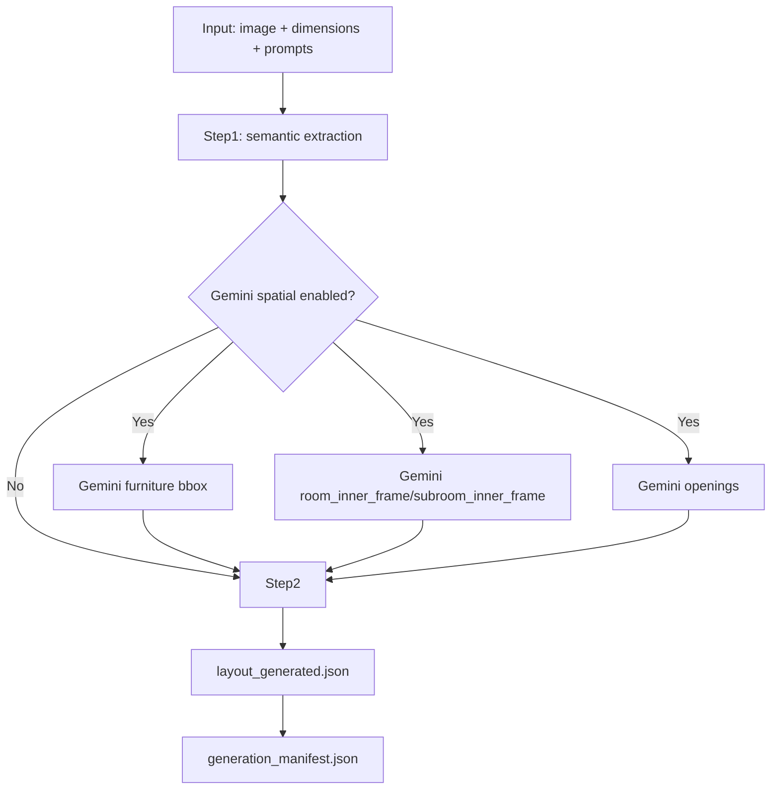

# JSON生成フロー整理（現行）と Step2 ルールベース仕様

## 1. 対象コード

- `experiments/src/generate_layout_json.py`
- `experiments/src/step2_rule_based.py`

## 2. 現行 JSON 生成フローの各ステップの役割

1. `Step0: 入力解決・前処理`
- 画像、dimensions、prompt パス、出力先を解決する。
- APIキーとプロバイダ（OpenAI/Gemini）利用可否を判定する。
- 画像を base64 化し、後段の LLM/Gemini 呼び出し入力を準備する。

2. `Step1: 意味理解（オブジェクト意図の抽出）`
- 役割: 部屋/家具/開口に関する意味情報を抽出する。
- 実行方式: `analysis_input` があれば再利用、なければ LLM 呼び出し。
- 主要出力: `step1_output_raw.json`, `step1_output_parsed.json`
- この段階で家具カテゴリ、概略位置、front_hint、room_id などの意味情報を得る。

3. `Step1.5: Gemini Spatial 前処理（有効時）`
- 役割: 幾何（bbox/内枠/開口）を高精度に取得し、Step2へ渡す。
- 構成:
- 家具検出: `gemini_spatial_output.json`（家具の 2D bbox）
- 内枠検出: `gemini_room_inner_frame_output.json`（`room_inner_frame` + `subroom_inner_frame`）
- 開口検出: `gemini_openings_output.json`（door/sliding_door/window）
- 補助処理:
- `dimensions` から部屋数・型を読み、inner-frame プロンプト制約を動的生成
- 家具プロンプトに room/在庫ガード（文字囲い防止、walk-in closet誤検出抑制）を付与
- 内枠結果から `main_room_inner_boundary_hint` を生成し、内壁基準座標系を作る

4. `Step2: 最終レイアウトJSON生成`
- `step2_mode=rule`:
- `build_layout_rule_based(...)` で deterministic に生成
- `step2_output_raw.json` にルール生成結果を保存
- `step2_mode=llm`:
- Step1 JSON + Gemini JSON + policy + dimensions を合成して LLM に最終整形させる
- 主要出力: `layout_generated.json`

5. `Step3: マニフェスト出力`
- `generation_manifest.json` を保存する。
- 実行時間、利用モデル、token 使用量、入力ファイル、Gemini中間成果物パスを記録する。

## 3. Step2（rule mode）のルールベース処理仕様

1. `基準座標系の決定`
- Step1 の `area_size_X/Y` を基準サイズとする。
- `main_room_inner_boundary_hint` があれば、外周ではなく内壁矩形へ座標系を再定義する。
- 最終 `outer_polygon` はローカル原点 `(0,0)` の矩形として再構築する。

2. `room 構築`
- Step1 room polygon をローカル座標へ変換する。
- Gemini `room_inner_frame/subroom_inner_frame` があればそれを優先して `rooms` を再構築する。
- `subroom` は main room 近傍辺へスナップする。
- スナップ閾値は `0.8`、最大2辺まで。
- スナップ先 strip に家具障害物 bbox がある場合はスナップしない。

3. `opening（door/window）統合`
- Step1 openings をアンカーとし、Gemini opening bbox を候補として対応付ける。
- door は Step1 を優先する保守統合。
- 幅は ratio が整合（0.70〜1.30）の場合のみ Gemini 幅を採用。
- 中心シフトは許容範囲内のみ反映。
- window は Gemini を強く信頼して中心・幅を更新。
- opening の向き（vertical/horizontal）を推定し、front_hint も整合する角度に正規化する。

4. `room への opening 割当と再投影`
- opening の `room_ids` があればそれを優先、なければ point-in-polygon で room へ割当。
- subroom 側の door は、部屋壁の最寄り辺へ中心を再投影する。
- これによりドア中心が壁線から外れる問題を抑える。

5. `家具（area_objects_list）生成`
- floor を先頭で生成する。
- 家具は Step1 object を走査し、Gemini 候補と category alias でマッチングする。
- Gemini候補があれば bbox（中心・長辺短辺）を採用する。
- 候補がなければ Step1 値へフォールバックする。
- rotation は `front_hint` 優先で決定する。
- `front_hint` がない壁寄せ系カテゴリ（sink/storage/cabinet/tv/toilet）は壁向き推定で決める。
- `search_prompt` は Step1 の値を優先し、なければカテゴリ既定文を入れる。

6. `door object 化`
- openings（type=door）から `door_n` を生成する。
- 幾何は orientation 依存で決定する。
- vertical: `Length=0.05`, `Width=opening.Width`
- horizontal: `Length=opening.Width`, `Width=0.05`
- rotation は opening front_hint を優先し、なければ壁側から推定する。

7. `最終JSONの返却`
- `area_name`, `area_size_X/Y`, `size_mode=world`, `outer_polygon`, `rooms`, `windows`, `area_objects_list` を返す。

## 4. ルールベース Step2 の採用方針（要点）

- 意味（カテゴリ、機能向き、search_prompt）は Step1 を基礎にする。
- 幾何（家具bbox、内枠、開口）は Gemini を優先利用する。
- ただし door は幾何破綻を避けるため Step1 アンカーで保守的に融合する。
- 最終的に deterministic 出力にすることで、再現性とコスト制御を担保する。

## 5. Mermaid 図（全体フロー）

## 6. Mermaid 図（Step2 rule mode 詳細）

