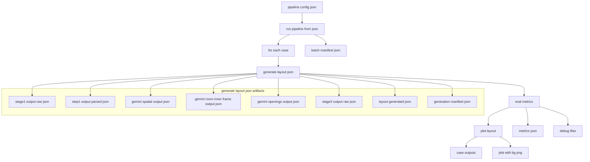
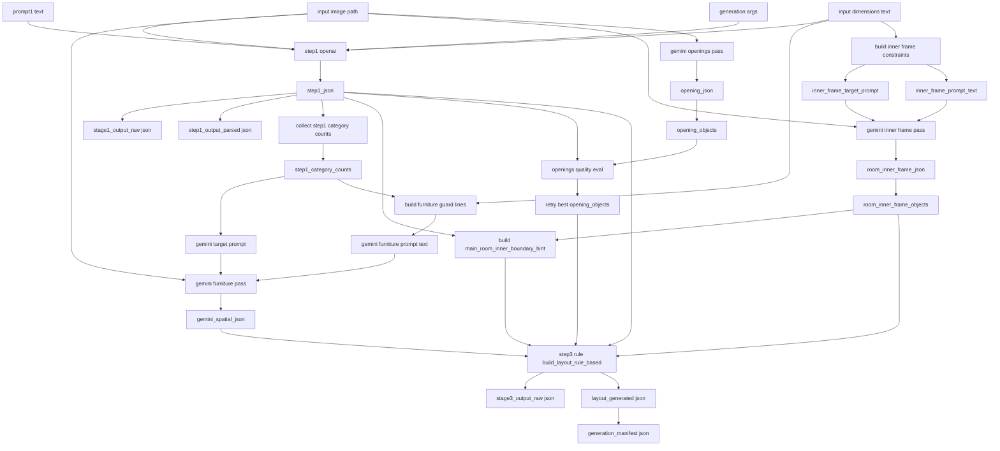
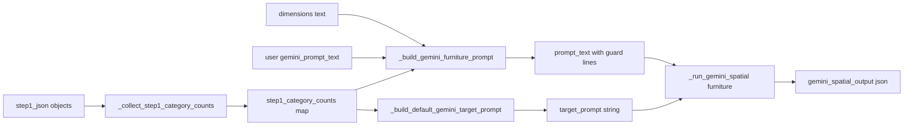
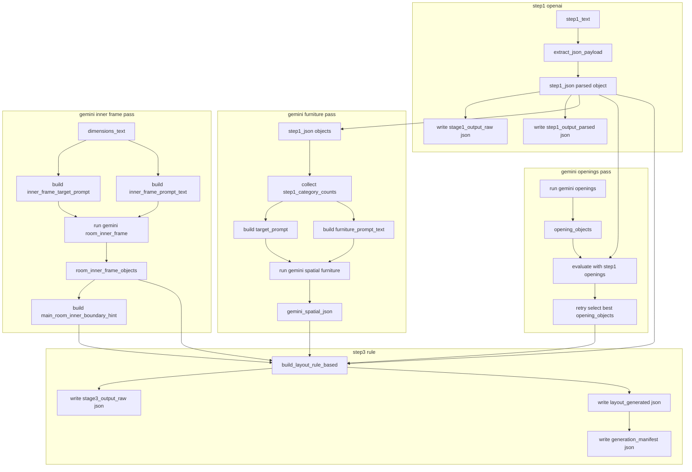
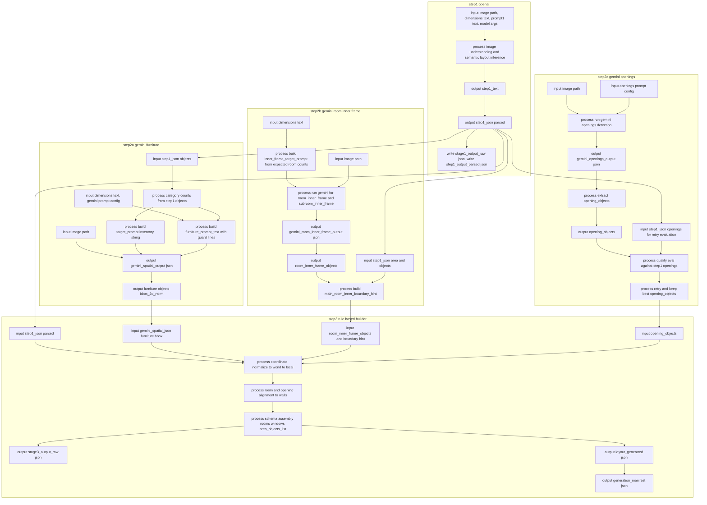

# Pipeline flow with config meaning and input output

Updated: 2026-02-23  
Historical target config: `experiments/configs/pipeline/latest_design_v2_gpt_high.json`

Status note:
- This document originally explained the `latest_design_v2_gpt_high.json` template/example config.
- The latest frozen latest-design file is `experiments/configs/pipeline/latest_design_v3_gpt_high_frozen_20260312.json`.
- The canonical upstream config for fixed-mode experiment reproduction is `experiments/configs/pipeline/fixed_mode_v2_gpt_high_batch_20260222.json`.

---

## 1. Purpose

This document explains the current pipeline as:
1. Which config key controls which stage
2. What each stage reads
3. What each stage writes

---

## 2. Config summary and meaning

## Global keys

| Key | Current value | Meaning |
|---|---|---|
| `continue_on_error` | `true` | Continue next case even if one case fails |
| `defaults.python_exec` | `.venv/bin/python` | Python interpreter used by stage commands |
| `defaults.run_root` | `experiments/runs/batch_v2_gpt_high_latest_design` | Output root for all case runs |

## Generation keys (`defaults.generation_args`)

| Key | Current value | Meaning |
|---|---|---|
| `model` | `gpt-5.2` | LLM used for Step1 |
| `reasoning_effort` | `high` | Step1 reasoning depth |
| `text_verbosity` | `high` | Step1 response detail level |
| `image_detail` | `high` | Image detail mode for Step1 |
| `max_output_tokens` | `32000` | Max tokens for generation call |
| `step2_mode` | `rule` | Use rule based Step2 instead of LLM Step2 |
| `step1_provider` | `openai` | Step1 provider |
| `step2_provider` | `openai` | Provider key kept for compatibility |
| `prompt1_path` | `prompts/prompt_1_universal_v4_posfix2_gemini_bridge_v1.txt` | Step1 prompt |
| `prompt2_path` | `prompts/prompt_2_universal_v4_posfix2_gemini_bridge_v1.txt` | Used only when `step2_mode=llm` |
| `enable_gemini_spatial` | `true` | Enable Gemini furniture detection pass |
| `enable_gemini_openings` | `true` | Enable Gemini openings and inner frame passes |
| `gemini_model` | `gemini-3-flash-preview` | Gemini model name |
| `gemini_task` | `boxes` | 2D bbox output mode |
| `gemini_label_language` | `English` | Label language in Gemini output |
| `gemini_temperature` | `0.6` | Gemini temperature |
| `gemini_thinking_budget` | `0` | Gemini thinking budget |
| `gemini_max_items` | `24` | Max returned detections |
| `gemini_resize_max` | `640` | Inference resize max |
| `gemini_prompt_text` | custom floorplan prompt | Furniture bbox detection instruction |

## Eval and plot keys

| Key | Current value | Meaning |
|---|---|---|
| `defaults.eval_args.config` | `experiments/configs/eval/default_eval.json` | Metric config path |
| `defaults.plot_args.enabled` | `true` | Enable `plot_with_bg.png` |
| `defaults.plot_args.bg_crop_mode` | `none` | Background crop behavior |

---

## 3. Stage by stage input output

## Stage A run coordinator

Program:
- `experiments/src/run_pipeline_from_json.py`

Input:
- pipeline config JSON

Output:
- per case execution
- `batch_manifest.json`

---

## Stage B generation

Program:
- `experiments/src/generate_layout_json.py`

Main inputs:
- `image_path` from case
- `dimensions_path` from case
- `prompt1_path`
- Gemini options from `generation_args`

Main outputs:
- `layout_generated.json`
- `generation_manifest.json`
- `stage1_output_raw.json`
- `step1_output_parsed.json`
- `stage3_output_raw.json`
- `gemini_spatial_output.json`
- `gemini_room_inner_frame_output.json`
- `gemini_openings_output.json`
- each Gemini plot and manifest file

---

## Stage C evaluation

Program:
- `experiments/src/eval_metrics.py`

Input:
- `layout_generated.json`
- eval config

Output:
- `metrics.json`
- `debug/` artifacts

---

## Stage D plotting

Program:
- `experiments/src/plot_layout_json.py`

Input:
- `layout_generated.json`
- original background image
- `metrics.json`
- `debug/task_points.json`
- `debug/path_cells.json`
- `gemini_room_inner_frame_output.json`

Output:
- `plot_with_bg.png`

---

## 4. End to end flow with artifacts



---

## 5. Generation internal flow with key level handoff



Responsibility split:
1. OpenAI Step1
- semantic understanding
- room inventory consistency
- functional orientation hint
- search prompt text

2. Gemini bridge
- furniture bbox geometry
- room inner frame geometry
- openings geometry

3. Step2 rule
- coordinate transform `norm -> world -> local`
- room and opening alignment to wall geometry
- schema assembly for final layout JSON

---

## 6. Step1 to Gemini furniture handoff detail



What is passed:
1. `target_prompt`
- inventory level instruction
- Example: `objects matching this inventory: bed x1, sink x1, ...`

2. `prompt_text`
- base furniture prompt
- dimensions derived room hints
- guard lines such as:
  - expected furniture inventory
  - room labels are not furniture
  - sink and storage separation rule

What is not passed:
1. Step1 per object bbox
2. Step1 per object front_hint
3. Step1 per object coordinates

---

## 7. Key level transfer map with file write points



---

## 8. Actual data example from one run

Example source:
- `experiments/runs/archive/archive_20260222_220433/batch_v2_gpt_high_latest_design/komazawakoen_B1_30_5.1x5.88_v2/generation_manifest.json`

Observed handoff values:
1. `step1_category_counts`
- `{"bed":1,"sink":1,"sofa":1,"storage":1,"table":1,"toilet":1,"tv_cabinet":1}`

2. furniture `target_prompt`
- `objects matching this inventory: bed x1, sink x1, sofa x1, storage x1, table x1, toilet x1, tv_cabinet x1`

3. inner frame target
- `room_inner_frame x1, subroom_inner_frame x1`

4. openings target
- `doors, sliding doors, windows`

5. detected object counts
- `room_inner_frame.object_count = 2`
- `openings.object_count = 3`

Interpretation:
1. Step1 parsed output is used as a control signal for Gemini furniture inventory.
2. Gemini furniture pass does not receive per object bbox or front_hint.
3. Step3 rule receives both semantic guide from Step1 and geometry from Gemini.

---

## 9. Step2 rule input output contract

Input contract:
- `step1_json`
- `gemini_spatial_json`
- `room_inner_frame_objects`
- `opening_objects`
- `main_room_inner_boundary_hint`

Output contract:
- `area_name`
- `area_size_X`
- `area_size_Y`
- `size_mode`
- `outer_polygon`
- `rooms`
- `windows`
- `area_objects_list`

---

## 10. One case output tree example

```
experiments/runs/batch_v2_gpt_high_latest_design/<case_name>/
  layout_generated.json
  generation_manifest.json
  stage1_output_raw.json
  step1_output_parsed.json
  stage3_output_raw.json
  gemini_spatial_output.json
  gemini_spatial_output_plot.png
  gemini_room_inner_frame_output.json
  gemini_room_inner_frame_output_plot.png
  gemini_openings_output.json
  gemini_openings_output_plot.png
  metrics.json
  debug/
  plot_with_bg.png
```

---

## 11. Step by step input process output diagram



Key point:
1. `step1_json parsed` is a real runtime input to three places:
- Gemini furniture control signal
- Gemini openings retry evaluation
- Step3 final builder
2. Gemini furniture receives inventory level guidance from Step1, not per object coordinates.
