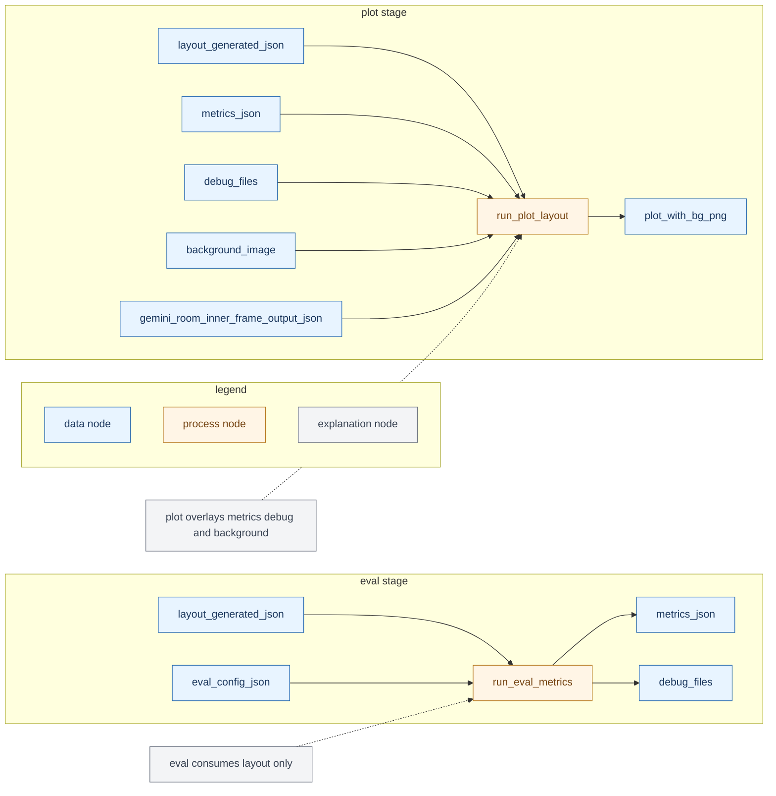

# Pipeline flow clean version input process output only

Updated: 2026-02-23  
Historical target: `experiments/configs/pipeline/latest_design_v2_gpt_high.json`

Status note:
- This document originally described the `latest_design_v2_gpt_high.json` example/template path.
- The latest frozen latest-design file is `experiments/configs/pipeline/latest_design_v3_gpt_high_frozen_20260312.json`.
- The canonical upstream config for fixed-mode experiment reproduction is `experiments/configs/pipeline/fixed_mode_v2_gpt_high_batch_20260222.json`.

---

## 1. Comment extraction by step

This section is only comments.  
Flow diagrams are in section 2 and use input process output structure only.

## Step1 openai
- Input: `image_path`, `dimensions_text`, `prompt1_text`, model args
- Process: semantic layout inference and JSON extraction
- Output: `step1_json parsed`, `stage1_output_raw.json`, `step1_output_parsed.json`

## Step2a gemini furniture
- Input: image + `step1_json.objects` + dimensions context + gemini furniture config
- Process:
1. build `step1_category_counts`
2. build `target_prompt` from inventory counts
3. build `furniture_prompt_text` with guard lines
4. run gemini furniture detection
- Output: `gemini_spatial_output.json`, normalized furniture boxes

## Step2b gemini room inner frame
- Input: image + dimensions + step1 area object context + inner frame config
- Process:
1. build inner frame target prompt from expected room counts
2. run gemini inner frame detection
3. build `main_room_inner_boundary_hint`
- Output: `gemini_room_inner_frame_output.json`, `room_inner_frame_objects`, boundary hint

## Step2c gemini openings
- Input: image + openings config + `step1_json.openings`
- Process:
1. run gemini openings detection
2. extract opening objects
3. evaluate quality against step1 openings
4. retry and keep best opening objects
- Output: `gemini_openings_output.json`, best `opening_objects`

## Step3 rule
- Input: `step1_json parsed` + gemini outputs
- Process:
1. `norm -> world -> local` transform
2. room and opening wall alignment
3. final schema assembly
- Output: `stage3_output_raw.json`, `layout_generated.json`, `generation_manifest.json`

## Eval and Plot
- Eval input: `layout_generated.json` + eval config
- Eval output: `metrics.json`, debug files
- Plot input: layout + metrics + debug + background image + inner frame json
- Plot output: `plot_with_bg.png`

---

## 2. Clean flow diagram generation core

```mermaid
flowchart TB
    classDef data fill:#e8f4ff,stroke:#2b6cb0,color:#1a365d,stroke-width:1px;
    classDef proc fill:#fff5e6,stroke:#b7791f,color:#744210,stroke-width:1px;
    classDef note fill:#f3f4f6,stroke:#6b7280,color:#374151,stroke-width:1px;

    subgraph LEGEND[legend]
        L1[data node]
        L2[process node]
        L3[explanation node]
    end

    subgraph STEP1[step1 openai]
        subgraph STEP1_IN[step1 input]
            S1I1[image_path]
            S1I2[dimensions_text]
            S1I3[prompt1_text]
            S1I4[model_args]
        end
        subgraph STEP1_PROC[step1 process]
            S1P1[run_step1_openai_inference]
            S1P2[extract_json_payload]
        end
        subgraph STEP1_OUT[step1 output]
            S1O1[step1_text_raw]
            S1O2[step1_json_parsed]
            S1O3[stage1_output_raw_json]
            S1O4[step1_output_parsed_json]
        end
        S1I1 --> S1P1
        S1I2 --> S1P1
        S1I3 --> S1P1
        S1I4 --> S1P1
        S1P1 --> S1O1 --> S1P2 --> S1O2
        S1O2 --> S1O3
        S1O2 --> S1O4
    end

    subgraph STEP2A[step2a gemini furniture]
        subgraph STEP2A_IN[step2a input]
            S2AI1[image_path]
            S2AI2[step1_json_objects]
            S2AI3[dimensions_text]
            S2AI4[gemini_furniture_config]
        end
        subgraph STEP2A_PROC[step2a process]
            S2AP1[collect_step1_category_counts]
            S2AP2[build_target_prompt]
            S2AP3[build_furniture_prompt_text]
            S2AP4[run_gemini_furniture]
        end
        subgraph STEP2A_OUT[step2a output]
            S2AO1[gemini_spatial_output_json]
            S2AO2[furniture_objects_norm_boxes]
        end
        S2AI2 --> S2AP1 --> S2AP2 --> S2AP4
        S2AI2 --> S2AP3
        S2AI3 --> S2AP3
        S2AI4 --> S2AP4
        S2AI1 --> S2AP4
        S2AP3 --> S2AP4 --> S2AO1 --> S2AO2
    end

    subgraph STEP2B[step2b gemini room inner frame]
        subgraph STEP2B_IN[step2b input]
            S2BI1[image_path]
            S2BI2[dimensions_text]
            S2BI3[step1_json_area_and_objects]
            S2BI4[gemini_inner_frame_config]
        end
        subgraph STEP2B_PROC[step2b process]
            S2BP1[build_inner_frame_target_prompt]
            S2BP2[build_inner_frame_prompt_text]
            S2BP3[run_gemini_inner_frame]
            S2BP4[build_main_room_inner_boundary_hint]
        end
        subgraph STEP2B_OUT[step2b output]
            S2BO1[gemini_room_inner_frame_output_json]
            S2BO2[room_inner_frame_objects]
            S2BO3[main_room_inner_boundary_hint]
        end
        S2BI2 --> S2BP1
        S2BI2 --> S2BP2
        S2BI4 --> S2BP3
        S2BI1 --> S2BP3
        S2BP1 --> S2BP3
        S2BP2 --> S2BP3 --> S2BO1 --> S2BO2
        S2BI3 --> S2BP4
        S2BO2 --> S2BP4 --> S2BO3
    end

    subgraph STEP2C[step2c gemini openings]
        subgraph STEP2C_IN[step2c input]
            S2CI1[image_path]
            S2CI2[step1_json_openings]
            S2CI3[gemini_openings_config]
        end
        subgraph STEP2C_PROC[step2c process]
            S2CP1[run_gemini_openings]
            S2CP2[extract_opening_objects]
            S2CP3[evaluate_openings_quality]
            S2CP4[retry_and_select_best_openings]
        end
        subgraph STEP2C_OUT[step2c output]
            S2CO1[gemini_openings_output_json]
            S2CO2[opening_objects_best]
        end
        S2CI1 --> S2CP1
        S2CI3 --> S2CP1 --> S2CO1 --> S2CP2 --> S2CP3 --> S2CP4 --> S2CO2
        S2CI2 --> S2CP3
    end

    subgraph STEP3[step3 rule builder]
        subgraph STEP3_IN[step3 input]
            S3I1[step1_json_parsed]
            S3I2[gemini_spatial_json]
            S3I3[room_inner_frame_objects]
            S3I4[main_room_inner_boundary_hint]
            S3I5[opening_objects_best]
        end
        subgraph STEP3_PROC[step3 process]
            S3P1[transform_norm_world_local]
            S3P2[align_rooms_openings_to_walls]
            S3P3[assemble_layout_schema]
        end
        subgraph STEP3_OUT[step3 output]
            S3O1[stage3_output_raw_json]
            S3O2[layout_generated_json]
            S3O3[generation_manifest_json]
        end
        S3I1 --> S3P1
        S3I2 --> S3P1
        S3I3 --> S3P1
        S3I4 --> S3P1
        S3I5 --> S3P1
        S3P1 --> S3P2 --> S3P3 --> S3O1
        S3P3 --> S3O2 --> S3O3
    end

    S1O2 --> S2AI2
    S1O2 --> S2BI3
    S1O2 --> S2CI2
    S1O2 --> S3I1

    S2AO1 --> S3I2
    S2BO2 --> S3I3
    S2BO3 --> S3I4
    S2CO2 --> S3I5

    N1[step1_json_parsed is shared runtime data]
    N2[furniture pass uses inventory counts not per object bbox]
    N1 -.-> S1O2
    N2 -.-> S2AP2

    class L1,S1I1,S1I2,S1I3,S1I4,S1O1,S1O2,S1O3,S1O4,S2AI1,S2AI2,S2AI3,S2AI4,S2AO1,S2AO2,S2BI1,S2BI2,S2BI3,S2BI4,S2BO1,S2BO2,S2BO3,S2CI1,S2CI2,S2CI3,S2CO1,S2CO2,S3I1,S3I2,S3I3,S3I4,S3I5,S3O1,S3O2,S3O3 data;
    class L2,S1P1,S1P2,S2AP1,S2AP2,S2AP3,S2AP4,S2BP1,S2BP2,S2BP3,S2BP4,S2CP1,S2CP2,S2CP3,S2CP4,S3P1,S3P2,S3P3 proc;
    class L3,N1,N2 note;
```

---

## 3. Clean flow diagram eval and plot

