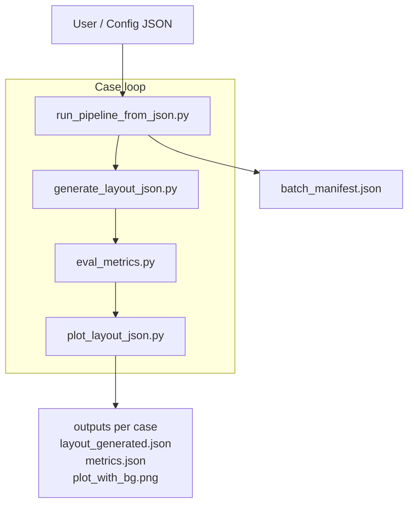
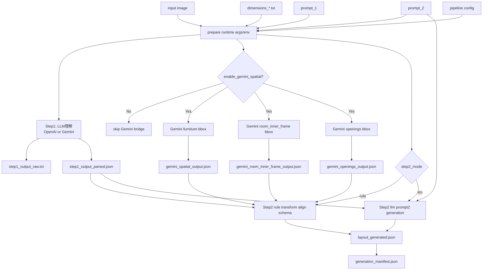
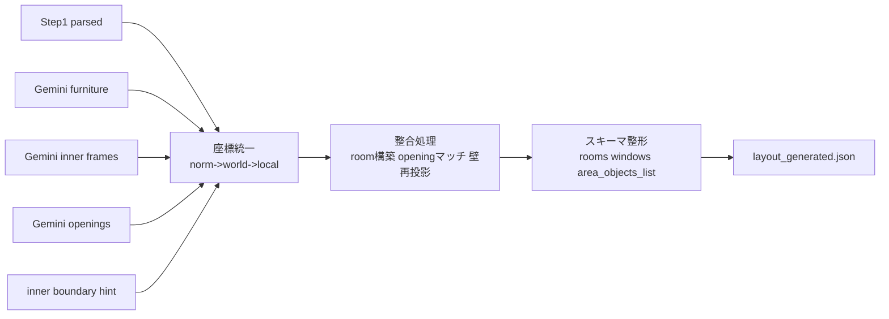
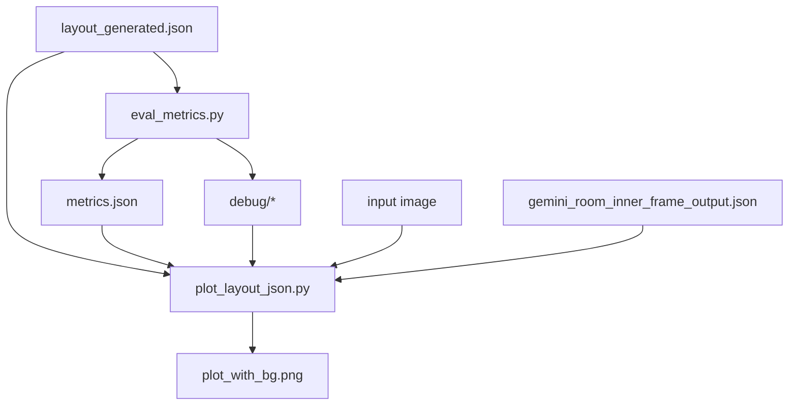
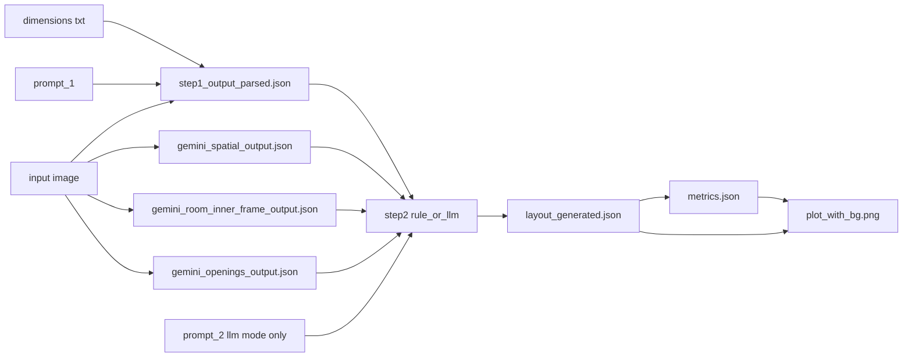

# End-to-End Pipeline Overview (Mermaid)

最終更新: 2026-02-23  
目的: Step2単体ではなく、画像入力から評価可視化までの全体フローを mermaid で把握する。

---

## 1. 全体実行フロー（ケース単位）

---

## 2. `generate_layout_json.py` の内部フロー

---

## 3. Step2(rule) の中身（全体内での位置づけ）

---

## 4. 評価・可視化フロー

---

## 5. 生成物依存関係（Artifact Graph）

---

## 6. 実運用での読み方

- 失敗切り分けは `2 -> 3 -> 4` の順に見る。
- 幾何ズレは `Gemini outputs` と `Step2(rule)` の間で発生しやすい。
- 見た目ズレは `plot_layout_json.py` 側（背景貼り合わせ・inner frame適用）も確認する。
