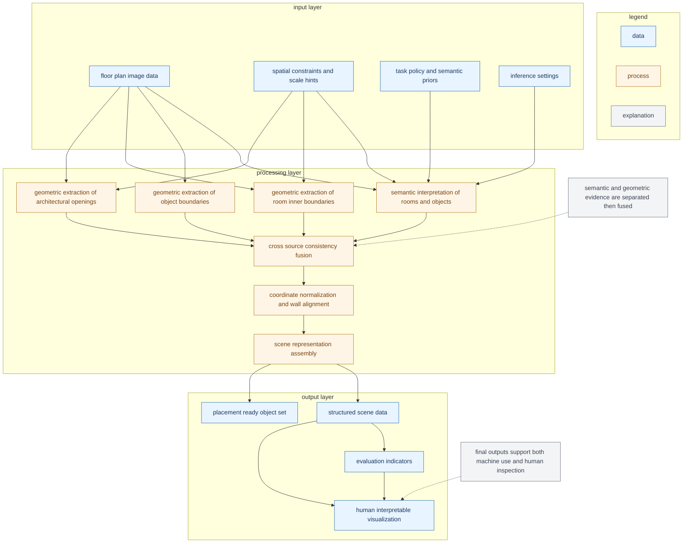
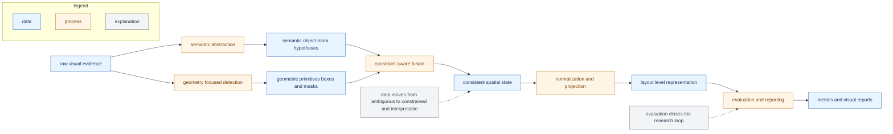

# Research oriented pipeline flow abstract version

Updated: 2026-02-23

This document is an abstract research view of the pipeline.  
It focuses on:
1. what kind of data is input
2. how data is transformed
3. what kind of outputs are produced

No implementation file names or concrete json keys are used.

---

## 1. Data processing pipeline abstract

---

## 2. Research view data transformation map

---

## 3. Reading guide for first time readers

1. Start from `input layer` and confirm what data types are available.
2. Read `processing layer` as three phases:
- semantic estimation
- geometric extraction
- fusion and normalization
3. Confirm that outputs are dual purpose:
- machine consumable scene structure
- human verifiable visual evidence

