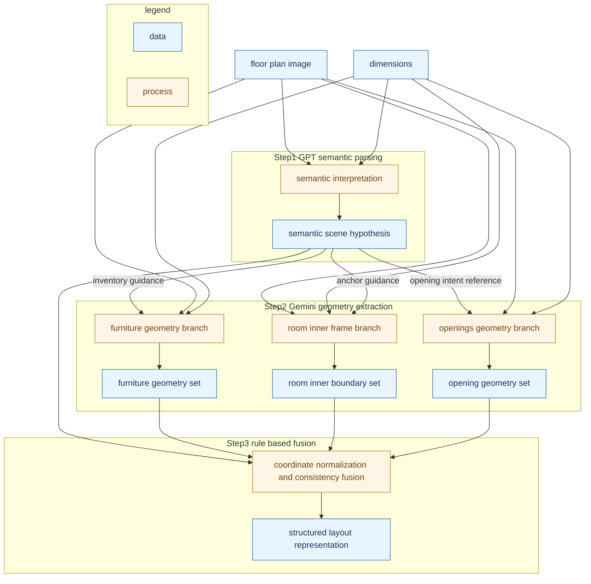

# Research flow with GPT and Gemini focus points

Updated: 2026-02-23

Goal:
1. Keep model step names explicit: GPT and Gemini
2. Show what data each step consumes
3. Show what each step focuses on during processing
4. Show what data each step outputs

---

## 1. Step focus matrix

| Step | Model or method | Main input data | Processing focus | Main output data |
|---|---|---|---|---|
| Step1 | GPT semantic parser | floor plan image, dimensions | room and object semantics, category intent, functional orientation hints, opening intent | semantic scene hypothesis |
| Step2A | Gemini furniture geometry | image, dimensions, Step1 inventory guidance | fixture outline contour, text exclusion, tight furniture bounding geometry | furniture geometry set |
| Step2B | Gemini room inner frame | image, dimensions, Step1 anchor guidance | inside wall boundary, maximal inner rectangles for main and sub rooms | room inner boundary set |
| Step2C | Gemini openings geometry | image, dimensions, Step1 opening intent reference | opening gap detection, sliding door gap span, exclusion of storage pocket area | opening geometry set |
| Step3 | Rule based fusion | Step1 semantic hypothesis, Gemini geometry outputs | coordinate unification, wall alignment, consistency resolution, final schema assembly | structured layout representation |

---

## 2. Data flow with explicit Step1 Step2 Step3

---

## 3. Focus points by step

| Step | Focus point |
|---|---|
| Step1 GPT | semantic meaning of rooms and objects, functional orientation hints, opening intent |
| Step2A Gemini furniture | contour of real fixtures, exclusion of text glyph regions |
| Step2B Gemini inner frame | inside wall boundary and maximal room coverage |
| Step2C Gemini openings | opening gap span, exclusion of sliding panel storage region |
| Step3 rule fusion | normalize coordinates and enforce wall consistent placement |

---

## 4. Practical reading order

1. Follow `Step1 GPT` to understand semantic control signals.
2. Check three Gemini branches separately:
- furniture geometry
- room inner boundary
- openings geometry
3. Confirm how `Step3 rule based fusion` resolves all branches into one consistent spatial representation.
