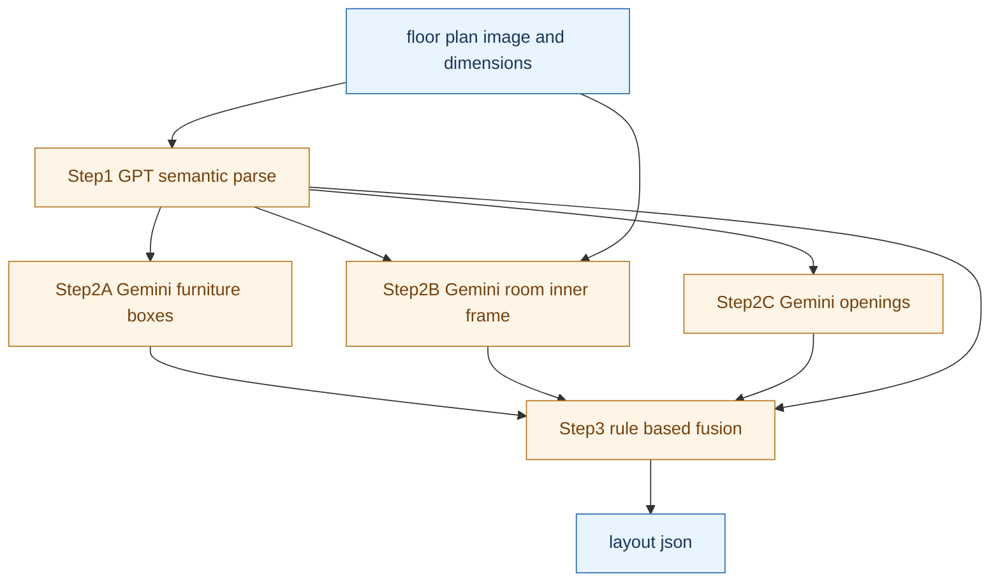
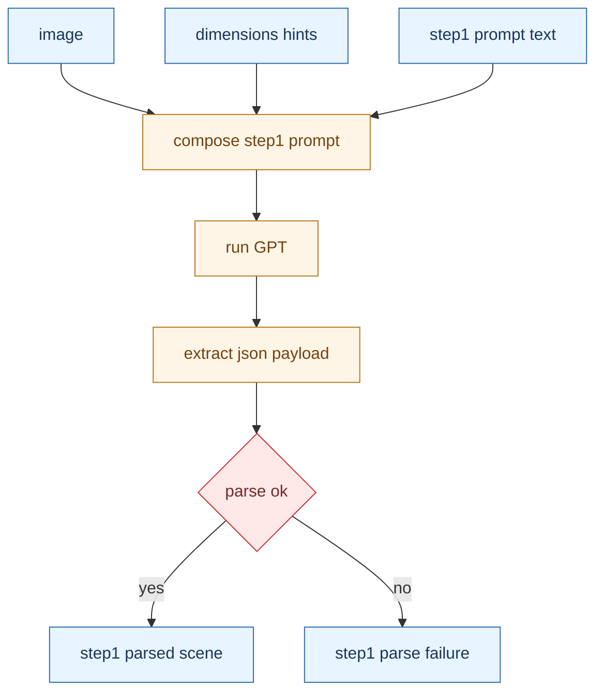
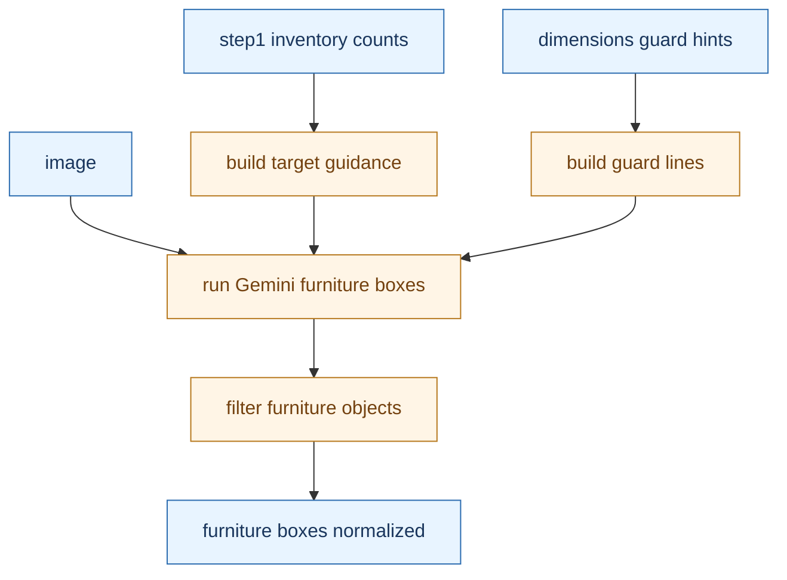
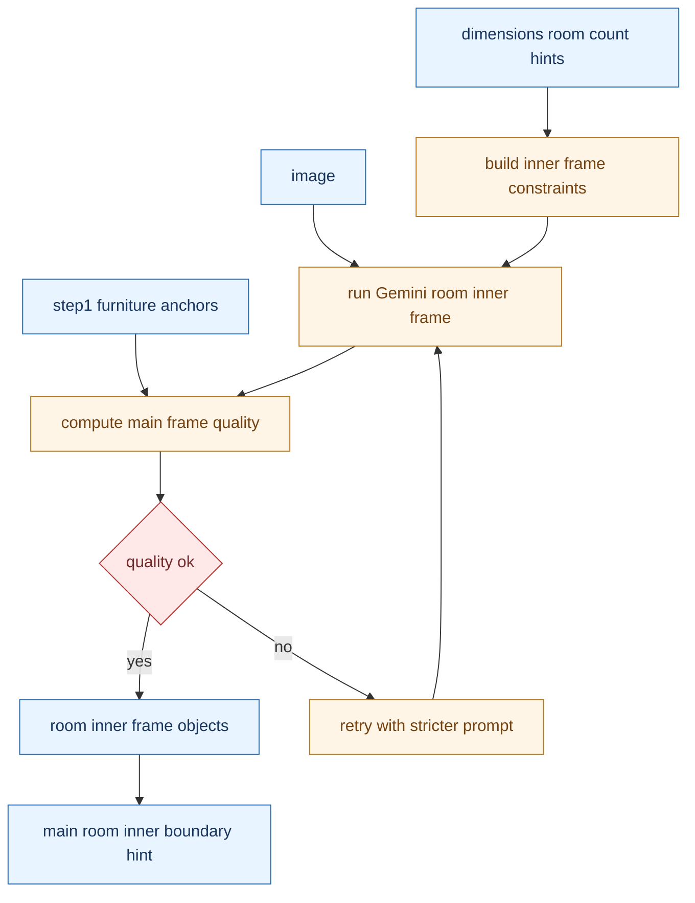
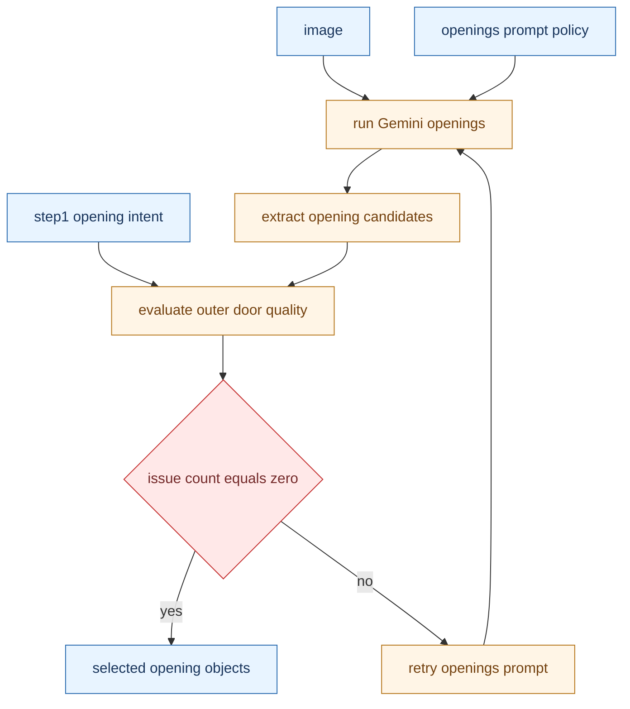
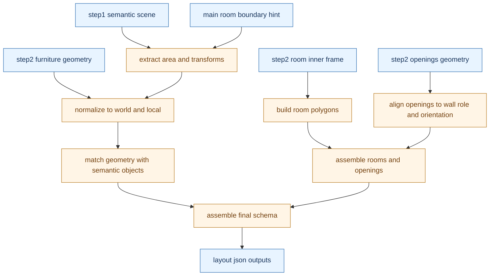

# パイプライン各ステップ詳細（目的・low quality基準つき）

Updated: 2026-02-23  
Scope: 生成フロー（Step1〜Step3）  
Code basis: `experiments/src/generate_layout_json.py`, `experiments/src/step2_rule_based.py`

---

## 0. 全体フロー（役割だけ先に）

---

## 1. Step1 GPT semantic parse

### 1.1 目的
- 画像から「意味情報」を作る。
- 具体的には、部屋構成・家具カテゴリ・機能的向きの初期仮説を作る。

### 1.2 入力
- `floor plan image`
- `dimensions.txt`（スケール、部屋数、開口数のヒント）
- Step1 prompt

### 1.3 何に注目して処理するか
- ラベル文字だけでなく、家具や部屋の関係性。
- 後続Stepで使う inventory と向きヒント。

### 1.4 low quality 判定基準
- このステップ単体には数値閾値の品質判定はない。
- 実装上の失敗判定は次のみ。
1. モデル応答が空。
2. JSON payload 抽出に失敗。

### 1.5 再試行・フォールバック
- Step1専用の品質再試行ループはなし。
- 品質吸収は後続の Step2B/Step2C の retry と Step3 の整合で行う。

### 1.6 次段への受け渡し
- Step2A: 家具カテゴリ件数（inventory guidance）
- Step2B: 家具アンカー（主室妥当性チェック用）
- Step2C: 開口の意図情報（outer/interior, wall, 位置, 幅）
- Step3: セマンティック基準（オブジェクト意味、front hint）

---

## 2. Step2A Gemini furniture boxes

### 2.1 目的
- 家具の幾何（2D bbox）を高精度で取得する。
- ここでは「位置とサイズ」を優先し、意味解釈は最小化する。

### 2.2 入力
- `floor plan image`
- `furniture prompt policy`（Step2A prompt text）
- Step1 parsed scene（カテゴリ件数）
- `dimensions.txt` 由来のガード文

### 2.2.1 Step2A 固有プロンプト（実装で実際に使うもの）
- ベース本文:
1. `DEFAULT_GEMINI_FURNITURE_PROMPT`
- 動的追記:
1. `_build_gemini_furniture_prompt(...)` で `ADDITIONAL_CONSTRAINTS` を付与。
2. `dimensions.txt` の `ROOMS` 由来の部屋ヒント。
3. Step1由来の inventory（期待家具カテゴリ件数）。
- target prompt:
1. `--gemini_target_prompt` 指定があればそれを使用。
2. 未指定なら `_build_default_gemini_target_prompt(step1_category_counts)` を使用。
- 上書き方法:
1. `--gemini_prompt_text` または `--gemini_prompt_text_path` で本文を差し替え可能。

### 2.3 何に注目して処理するか
- 家具の輪郭線（文字ではなく外形）。
- Step1 inventory を使って過不足検出を抑える。

### 2.4 low quality 判定基準
- このステップ単体には明示閾値での retry 判定はない。
- 実装上は「Gemini結果が空」または「有効 bbox なし」が実質的不良。

### 2.5 再試行・フォールバック
- 専用 retry ループなし。
- Step3 で Step1 semantic と突合し、候補選択・補完で吸収する。

### 2.6 次段への受け渡し
- `furniture geometry detections`（正規化bbox中心）を Step3 に渡す。

---

## 3. Step2B Gemini room inner frame

### 3.1 目的
- 主室と副室の「内壁内矩形」を取る。
- 最終プロット基準を外壁ではなく内壁側に寄せる。

### 3.2 入力
- `floor plan image`
- `inner frame prompt policy`（Step2B prompt text）
- `dimensions.txt`（期待部屋数）
- Step1 parsed scene（家具アンカー）

### 3.2.1 Step2B 固有プロンプト（実装で実際に使うもの）
- ベース本文:
1. `DEFAULT_GEMINI_ROOM_INNER_FRAME_PROMPT`
- 動的追記:
1. `_build_room_inner_frame_constraints(dimensions_text)` で `ROOM_CONSTRAINTS` を生成して追記。
2. 例: `EXPECTED_TOTAL_ROOMS`、`EXPECTED_SUBROOM_COUNT`、`AREA_SIZE_M`、`MAX_RECT_RULE`。
- target prompt:
1. 同関数で動的生成。
2. 例: `room_inner_frame x1, subroom_inner_frame xN`。
- 上書き方法:
1. `--gemini_room_inner_frame_prompt_text_path` で本文差し替え可能。
2. retry時は本文に `RETRY_INSTRUCTION` を追加して再実行。

### 3.3 何に注目して処理するか
- 内壁ラインの連続性。
- 主室候補が家具アンカーをどれだけ包含するか。

### 3.4 low quality 判定基準（コード閾値）
- 実装関数: `_build_main_room_inner_boundary_hint`
- 主候補を bad とみなす条件:
1. `coverage_x < 0.70`
2. または `coverage_y < 0.70`
3. または `anchor_inside_ratio < 0.55`
- bad の場合、複数候補の envelope へフォールバック（`selection_mode = envelope_fallback`）。

- 実装関数: `_needs_room_inner_frame_retry`
- retry 判定（既定）:
1. `coverage_x < 0.88`
2. または `coverage_y < 0.88`
3. または `anchor_inside_ratio < 0.55`

### 3.5 再試行・フォールバック
- `gemini_inner_frame_retry_max_retries` 既定 `1` 回。
- retry 温度未指定時は `min(base_temperature, 0.45)` を使用。
- retry prompt で「内壁線に沿って最大化」「文字で縮まない」を強制。

### 3.6 次段への受け渡し
- `room inner frame objects`
- `main_room_inner_boundary_hint`（Step3の座標変換基準）

---

## 4. Step2C Gemini openings

### 4.1 目的
- 開口部（door, sliding door, window）の幾何を取得する。
- とくに outer door の取りこぼしを抑える。

### 4.2 入力
- `floor plan image`
- openings prompt policy
- Step1 parsed openings（type, wall role, center, width）

### 4.3 何に注目して処理するか
- 開口の壁切れ目形状。
- Step1 outer door と幅・中心の整合。

### 4.4 low quality 判定基準（コード閾値）
- 実装関数: `_evaluate_openings_quality_for_retry`
- 評価対象: Step1で `type=door` かつ `outer` 判定の開口。
- issue 条件:
1. 候補が見つからない（`missing_candidate`）。
2. `width_ratio < 0.72`（既定）。
3. `center_dist_m > 0.85`（既定）。
- 低品質判定は `issue_count > 0`。

### 4.5 再試行・フォールバック
- `gemini_openings_retry_max_retries` 既定 `1` 回。
- retry 中は「開口全幅を取る」「収納ポケット領域は除外」を追加指示。
- 最良結果選択: `_is_openings_eval_better`
1. `issue_count` が小さい方を優先。
2. 同数なら `score` が低い方を採用。

### 4.6 次段への受け渡し
- `opening_objects`（選抜済み）を Step3 に渡す。

---

## 5. Step3 rule based fusion

### 5.1 目的
- Step1 semantic と Step2 geometry を統合し、最終 `layout.json` を決定論で組み立てる。
- LLM再推論ではなく、座標変換と整合処理を担当する。

### 5.2 入力
- Step1 parsed scene
- Step2A furniture boxes
- Step2B room inner frames と main boundary hint
- Step2C openings

### 5.3 何に注目して処理するか
- 正規化bboxを world/local に正しく写像。
- 開口は壁方向へ再投影して配置整合。
- 家具は Gemini bbox 優先で semantic object と対応付け。

### 5.4 low quality 判定基準
- このステップは retry ではなく、ルールペナルティで候補を比較する。
- 実装関数: `_pick_opening_candidate`
- 主要なペナルティ境界:
1. `width_ratio < 0.45` または `> 2.0` で強ペナルティ。
2. `width_ratio < 0.65` または `> 1.6` で中ペナルティ。
3. `sliding` 候補で `width_ratio > 1.35` なら追加ペナルティ。
- 方向不一致、外壁/内壁ロール不一致もスコア悪化要因。

### 5.5 再試行・フォールバック
- Step3自体の再推論はなし。
- 候補不足時は最善候補や Step1 幾何へフォールバックしてスキーマを完結させる。

### 5.6 出力
- `layout_generated.json`
- `stage3_output_raw.json`
- `generation_manifest.json`

---

## 6. low quality 判定の要点まとめ

- Step1:
1. 数値閾値なし。
2. 空応答またはJSON抽出失敗を失敗扱い。

- Step2A:
1. 専用の数値品質ゲートなし。
2. 実質は Step3 統合時に吸収。

- Step2B:
1. bad main 判定 `0.70 / 0.70 / 0.55`。
2. retry 判定 `0.88 / 0.88 / 0.55`。

- Step2C:
1. `width_ratio < 0.72`。
2. `center_dist_m > 0.85`。
3. `missing_candidate`。
4. `issue_count > 0` で retry。

- Step3:
1. 推論再試行なし。
2. ルールスコアとフォールバックで整合確保。

---

## 7. 評価基準の変数が意味するもの（実務解釈）

ここでは `low quality` と `retry` で使っている変数の意味を、式と直感で整理する。

### 7.1 Step2B（room inner frame）

1. `coverage_x`
- 定義: `primary_box_width / area_size_X`
- 意味: 主室候補が「横方向にどれだけ全体をカバーしているか」。
- 解釈:
1. 小さすぎると、主室bboxが途中で切れている可能性が高い。
2. 1.0に近いほど、横方向の取りこぼしが少ない。

2. `coverage_y`
- 定義: `primary_box_height / area_size_Y`
- 意味: 主室候補が「縦方向にどれだけ全体をカバーしているか」。
- 解釈:
1. 小さすぎると、主室bboxが上下どちらかで欠けている。

3. `anchor_inside_ratio`
- 定義: `主室候補内に入っている家具アンカー数 / 全家具アンカー数`
- 意味: Step1で得た家具中心が、主室候補にどれだけ内包されるか。
- 解釈:
1. 低いと「主室の場所を間違えている」可能性が高い。
2. レイアウトの意味整合を測る指標。

4. `selection_mode`
- 値: `primary_main` または `envelope_fallback`
- 意味:
1. `primary_main`: 最大主候補をそのまま採用。
2. `envelope_fallback`: 候補群の外接矩形で救済採用。
- 解釈: inner frame が壊れたときの安全弁が動いたかどうかを示す。

### 7.2 Step2C（openings）

1. `width_ratio`
- 定義: `Gemini候補の開口幅 / Step1想定の開口幅`
- 意味: 開口幅の一致度。
- 解釈:
1. 1.0付近が理想。
2. 小さすぎると「開口の一部だけ取れている」。
3. 大きすぎると「収納部や壁外領域まで含めた」可能性がある。

2. `center_dist_m`
- 定義: `Gemini候補中心` と `Step1想定中心` のユークリッド距離[m]
- 意味: 位置ずれ量。
- 解釈:
1. 大きいほど、別の開口を拾った/壁位置の解釈がズレた可能性が高い。

3. `issue_count`
- 定義: outer door 評価で問題判定された件数。
- 問題条件: `missing_candidate` / `width_ratio未達` / `center_dist超過`。
- 解釈:
1. 0が理想。
2. retry可否の一次判定に使う。

4. `score`
- 定義: 候補マッチング時の総合誤差スコア（距離・幅差・向きなどの合算）。
- 解釈:
1. `issue_count` が同数のとき、より小さい方を採用。
2. 「同程度に問題がある候補」同士の優劣づけ用。

### 7.3 Step3（rule fusion）

1. `cand_width`
- 定義: 開口候補の幅（壁向きに応じて `dx` または `dy`）。
- 意味: 壁方向に対して実際に通行可能な開口スパン。

2. `base_w`
- 定義: Step1が想定した基準開口幅（最小0.05で下駄を履かせる）。
- 意味: 候補比較の基準長。

3. `width_ratio`（Step3内）
- 定義: `cand_width / base_w`
- 意味: ルールスコアでの幅整合評価。
- 解釈: しきい値に応じてペナルティ強度が変わる。

4. `d_along` / `d_cross`
- 定義:
1. `d_along`: 壁方向（長手方向）の中心差
2. `d_cross`: 壁に垂直な方向の中心差
- 意味: 開口が「同じ壁線上で」合っているかを測る。
- 解釈:
1. `d_cross` は強く罰するので、別壁への誤マッチを避ける。

5. `orient_penalty`
- 意味: 期待向き（vertical/horizontal）と候補向きが不一致の罰点。

6. `wall_role_match`
- 意味: outer開口は外周帯候補に、interior開口は内側候補に寄せる整合条件。
- 解釈: 外壁ドアと室内ドアの取り違えを抑制。

### 7.4 low quality と retry の関係（再確認）

1. `low quality` は「品質状態の判定」。
2. `retry` は「その判定を受けて再推論する運用アクション」。
3. `fallback` は「再推論せず既存候補で救済するルール処理」。

実装上は、Step2B/Step2C で `low quality` 判定を先に行い、条件に応じて `retry` または `fallback` を使い分ける。
