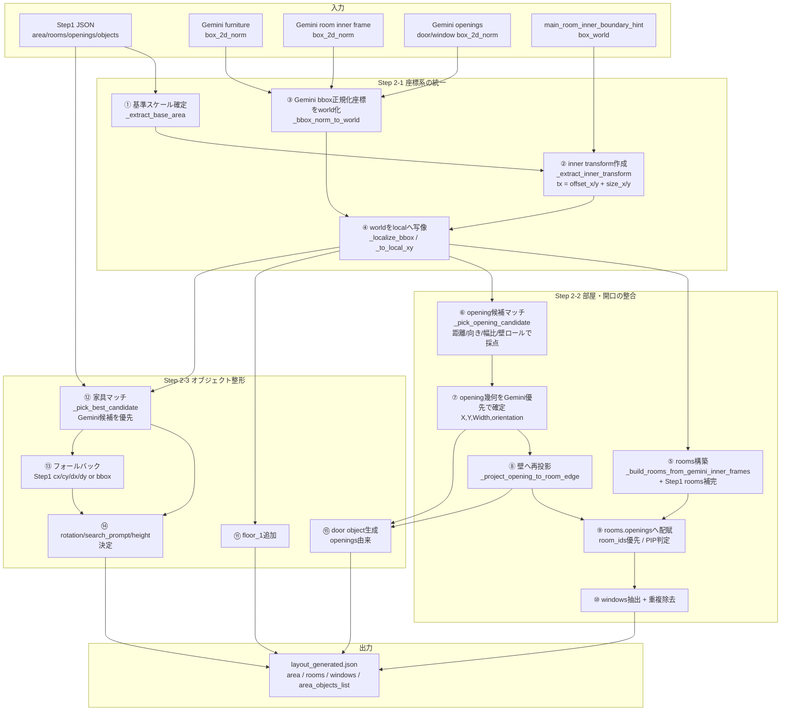

# Step2(rule) 詳細仕様メモ（変換・整合・スキーマ整形）

最終更新: 2026-02-23  
対象実装:
- `experiments/src/step2_rule_based.py`
- 呼び出し元: `experiments/src/generate_layout_json.py`（`--step2_mode rule`）

---

## 0. Step2(rule) の責務

Step2(rule) は **推論モデルではなく幾何ルール層**。責務は次の3つだけ。

1. Gemini/Step1 の座標を同一座標系にそろえる（`world`/`local`変換）
2. 開口部（door/window）を壁幾何に整合させる（再投影・向き整合）
3. 最終レイアウトJSONのスキーマへ整形する（`rooms/windows/area_objects_list`）

---

## 1. 入力と出力

## 入力
- `step1_json`
  - `area_size_X/Y`, `outer_polygon`, `rooms`, `openings`, `objects`
- `gemini_spatial_json`（家具bbox）
- `room_inner_frame_objects`（部屋内枠bbox）
- `opening_objects`（開口bbox）
- `main_room_inner_boundary_hint`（任意、main内枠）

## 出力
- 1つの layout JSON:
  - `area_name`
  - `area_size_X`, `area_size_Y`
  - `size_mode`
  - `outer_polygon`
  - `rooms`
  - `windows`
  - `area_objects_list`

---

## 2. 座標系の定義（重要）

Step2 では座標を2系統で扱う。

1. `world`
- 図面全体基準（Step1 と Gemini の共通基準）
- `area_size_X/Y` の範囲で表現

2. `local`
- 最終配置で使う内側基準
- `main_room_inner_boundary_hint.box_world` を基に原点を内側へ平行移動

補足:
- Step2 は回転変換をしない。  
- `local = world - (offset_x, offset_y)` + 範囲clamp のみ。

---

## 3. 変換ブロック（Gemini座標を world/local に変換）

## 3.1 基準サイズの決定
関数: `_extract_base_area(step1_json)`

優先順:
1. `step1_json.area_size_X/Y`
2. `step1_json.outer_polygon` の min/max 差分
3. fallback `1.0 x 1.0`

---

## 3.2 inner transform の決定
関数: `_extract_inner_transform(main_room_inner_boundary_hint, area_x, area_y)`

出力:
```json
{
  "offset_x": ...,
  "offset_y": ...,
  "size_x": ...,
  "size_y": ...
}
```

ルール:
- `main_room_inner_boundary_hint.box_world=[xmin,ymin,xmax,ymax]` が有効なら採用
- 小さすぎる（`sx<=0.05` or `sy<=0.05`）場合は無効扱い
- 無効時は `{offset=0, size=area}` にフォールバック

---

## 3.3 Gemini正規化bboxの world 化
関数: `_bbox_norm_to_world(box_2d_norm, area_x, area_y)`

入力仕様:
- `box_2d_norm = [nymin, nxmin, nymax, nxmax]`（0..1）

変換式:
- `xmin = clamp(nxmin,0,1) * area_x`
- `xmax = clamp(nxmax,0,1) * area_x`
- `ymax = (1 - clamp(nymin,0,1)) * area_y`
- `ymin = (1 - clamp(nymax,0,1)) * area_y`

その後:
- 逆転ケースを swap 補正
- `cx, cy, dx, dy` を算出
- `dx<=0` or `dy<=0` は破棄

---

## 3.4 world から local への写像
関数: `_localize_bbox(bbox_world, tx)` / `_to_local_xy(x,y,tx)`

処理:
- `x_local = clamp(x_world - offset_x, 0, size_x)`
- `y_local = clamp(y_world - offset_y, 0, size_y)`
- bbox は xmin/xmax, ymin/ymax それぞれに適用し、`cx/cy/dx/dy` 再計算

---

## 4. 壁再投影ブロック（開口部整合）

## 4.1 開口方向の初期推定
関数:
- `_opening_orientation(opening, area_x, area_y)`
- `_opening_front_hint(opening, orientation, x, y, area_x, area_y)`

概要:
- `wall` 文字列（north/east/partition_x など）を優先して
  - `vertical` or `horizontal` を判定
- 曖昧時は中心点の外周距離で縦横を決定
- `front_hint` は壁直交制約に丸める
  - vertical: `{90,270}`
  - horizontal: `{0,180}`

---

## 4.2 Gemini opening 候補の構築
関数: `_opening_candidates(opening_objects, area_x, area_y)`

処理:
- `category/label` から `door` or `window` を判定
- `box_2d_norm -> world` 変換
- 候補リスト化（`uid, kind, category, box_world`）

---

## 4.3 Step1 開口と Gemini 候補の対応付け
関数: `_pick_opening_candidate(...)`

候補スコア構成:
- 中心ズレ（along/cross）
- 幅差
- 幅比ペナルティ
  - 極端比率（`<0.45` or `>2.0`）で強ペナルティ
  - やや不一致（`<0.65` or `>1.6`）で中ペナルティ
  - `sliding` で過幅（`ratio>1.35`）を追加ペナルティ
- 向き不一致ペナルティ
- 壁ロール一致
  - `_opening_wall_role` で `outer/interior/unknown`
  - 候補の外周近傍判定は `outer_band = max(0.25, 0.08 * min(area_x, area_y))`

採用ルール:
- 壁ロール一致候補があればその中の最良
- 無ければ全候補中の最良（`best_any`）

---

## 4.4 Gemini幾何を優先して opening を更新
`build_layout_rule_based` 内で候補採用時:

- `b_local = _localize_bbox(cand.box_world, tx)`
- 幾何は Gemini 優先:
  - `orientation = vertical if dy>=dx else horizontal`
  - `X,Y = b_local.cx, b_local.cy`
  - `Width = (vertical ? b_local.dy : b_local.dx)`

---

## 4.5 部屋壁への再投影
関数: `_project_opening_to_room_edge(opening, room_polygon)`

処理:
- room polygon から bbox 化（`_room_bbox_from_polygon`）
- orientation が分かっていれば該当軸の最近壁へスナップ
  - vertical: `x -> xmin or xmax`, `y clamp`
  - horizontal: `y -> ymin or ymax`, `x clamp`
- 不明時は4辺距離最小辺へスナップ

適用箇所:
- `rooms[].openings` 作成時
- primary 以外の room の door を壁に再投影

---

## 5. スキーマ整形ブロック

## 5.1 `rooms` の構築
主関数:
- `_extract_step1_rooms_local(...)`
- `_build_rooms_from_gemini_inner_frames(...)`

流れ:
1. Step1 rooms を local 化
2. Gemini inner_frame を local bbox 化
3. subroom は `snap_threshold=0.8`, `max_snap_edges=2` で外周へ吸着
4. 障害物帯がある辺はスナップ禁止（`_subroom_strip_blocked`）
5. room polygon を矩形化して `rooms_out` を確定

primary room:
- room 面積最大を primary として採用

---

## 5.2 `openings` と `windows` の確定

`openings_final` を中間保持し、各 room に配賦:
- `room_ids` があればそれを優先
- 無ければ中心点の point-in-polygon

`windows`:
- `openings_final` から `type=window` 抽出
- `(X,Y,Width,Height,SillHeight)` で重複排除

---

## 5.3 `area_objects_list` の構築

順序:
1. `floor_1` を追加
2. Step1 objects を順に処理
3. Gemini家具候補を `_pick_best_candidate` で対応付け
4. 候補が無ければ Step1 値でフォールバック
5. `rotationZ` は `_rotation_for_object` で決定
6. 最後に door object を opening から生成

家具対応付け:
- 中心距離 + サイズ差の合成スコアで最小を採用
- category alias（例 `storage<->cabinet`, `tv<->tv_cabinet`）あり

フォールバック:
- `cx/cy/dx/dy` 優先
- それも無ければ `bbox` 差分で `Length/Width`

---

## 6. 重要な設計意図

1. **Gemini責務**  
家具・inner_frame・opening の「検出座標」を主に担う。

2. **Step2(rule)責務**  
検出値を壊さず、座標系整合・壁整合・JSON整形に限定。

3. **world/local を分ける理由**  
検出は図面全体、配置は内側基準。  
この差を吸収しないと、内壁基準の最終配置で壁ズレが出る。

---

## 7. デバッグ時の見る順番（実務用）

1. `step1_output_parsed.json`
- `openings`, `objects`, `front_hint`

2. `gemini_spatial_output.json`
- `furniture_objects[].box_2d_norm`

3. `gemini_room_inner_frame_output.json`
- main/subroom bbox の妥当性

4. `gemini_openings_output.json`
- door/window opening bbox の位置と幅

5. `layout_generated.json`
- `rooms`, `windows`, `area_objects_list` の最終整合

---

## 8. 処理フロー要約


